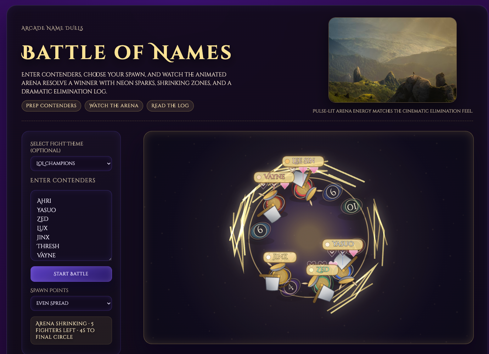

# v1 — Building the game with GPT-5-Codex

**Period:** October–November 2025  
**Model:** GPT-5-Codex, confirmed by the project author  
**Written retrospectively:** 26 September 2026  
**Git checkpoints:** `fbd8945` (first recorded prototype), `63a1be8` (end of the recorded November development phase)

## The first iteration

*The GPT-5-Codex version in action, showing its procedural fighters, floating nameplates and original arena effects. Screenshot supplied by the project author for this retrospective.*

## The idea

The starting question was simple: could picking a random name be more entertaining than spinning a wheel?

Instead of waiting for a pointer to stop, each name would become a contestant in a short, automatic free-for-all. Players would dodge, collide and fight inside a shrinking arena until one name won. The suspense of following a contender was the point; there was no need for a database or a large application framework.

GPT-5-Codex helped turn that brief into the first version of **Battle of Names**. The work progressed through an original specification and ten improvement notes, refining the mechanics, appearance, readability and setup flow.

## What the first version delivered

- A browser game built with TypeScript and Vite, using Canvas 2D for the arena and fighters and HTML/CSS for the interface.
- Name entry, a countdown, automatic movement and pursuit, three-hit health, collision feedback and elimination handling.
- A continuously shrinking safe area, lightning danger effects and pressure to return from outside the arena.
- Five spawn modes: Random, Even Spread, Clustered Teams, Center Drop and Storm Spawn. Even Spread became the default.
- Five predefined fight themes that populated the name input, while allowing custom names.
- A dark purple and gold fantasy identity, Cinzel Decorative typography, colourful fighters, runes, labels, axes and horned helmets.
- A live roster with health and damage feedback, a Fallen section, winner highlighting and a battle log with survival and combat statistics.
- SEO and social metadata, a sitemap, robots configuration and a GitHub Pages deployment workflow.

The fighters were drawn procedurally, with cached canvas sprites and separately drawn equipment and effects. Although we later referred to the old look conversationally as “CSS Vikings,” the battle renderer was already Canvas 2D. The later art work would change the assets and animation rather than introduce canvas for the first time.

## How the requirements evolved

The earliest brief allowed simple blobs in a ring or hexagon. Subsequent notes pushed the game toward Viking equipment and a fantasy arena, with faster movement, stronger collision feedback and clearer fighter identity.

Two changes established the eventual structure: the arena would shrink continuously without physically pushing fighters inward, and the page would use a two-column layout with the arena as the primary focus. Roster and name-label work made it easier to follow a particular contender through the chaos.

Not every idea in the notes was a shipped feature. Decorative tethers, configurable accessibility patterns and other suggested flourishes should be read as design proposals. The [consolidated v1 requirements](../../specs/requirements-v1.md) preserve that distinction.

## Recorded milestones

| Date | Git evidence | Milestone |
| --- | --- | --- |
| 12 October 2025 | `fbd8945` | First committed snapshot: “First commit, the progress so far” |
| 8 November 2025 | `42b4212`, `7747f57`, `ae499b9` | Built game, deployment workflow and SEO files |
| 9 November 2025 | `4f3e46c`, `299a258` | Analytics tag and predefined fighting themes |
| 9 November 2025 | `d73900f`, merged in `63a1be8` | Outside-area overlap detection and a pulsing danger indicator |

The first commit already contained work in progress, so it is an evidence boundary rather than a known project start date. No development commit dated 10 November appears in the inspected history.

## Where we left it

The initial version established the complete product loop: enter names, watch a fight, get a winner. By the final November snapshot, the outside-area grace period was two seconds, superseding the original one-second proposal. The game also had a 13.5-second maximum duration and a tie-breaking path; the later Astra phase removed the forced duration in favour of fighting until one contender remained.

There was no recorded comparable performance benchmark for this phase. Its achievement was a working game with a clear theme and a practical deployment path, ready to revisit with more attention to art direction and combat presentation.

**Next:** [v2 — The Astra adventure](v2-astra.md)

### Source notes

- [Original brief](../../specs/game-requirements-spec.md) and [consolidated requirements with links to all ten improvement notes](../../specs/requirements-v1.md).
- Historical implementation at `63a1be8`, particularly `src/main.ts`, `src/style.css`, `src/data/predefinedFights.ts` and `package.json`.
- Git dates describe repository milestones; model attribution comes from the project author, not from commit metadata.
