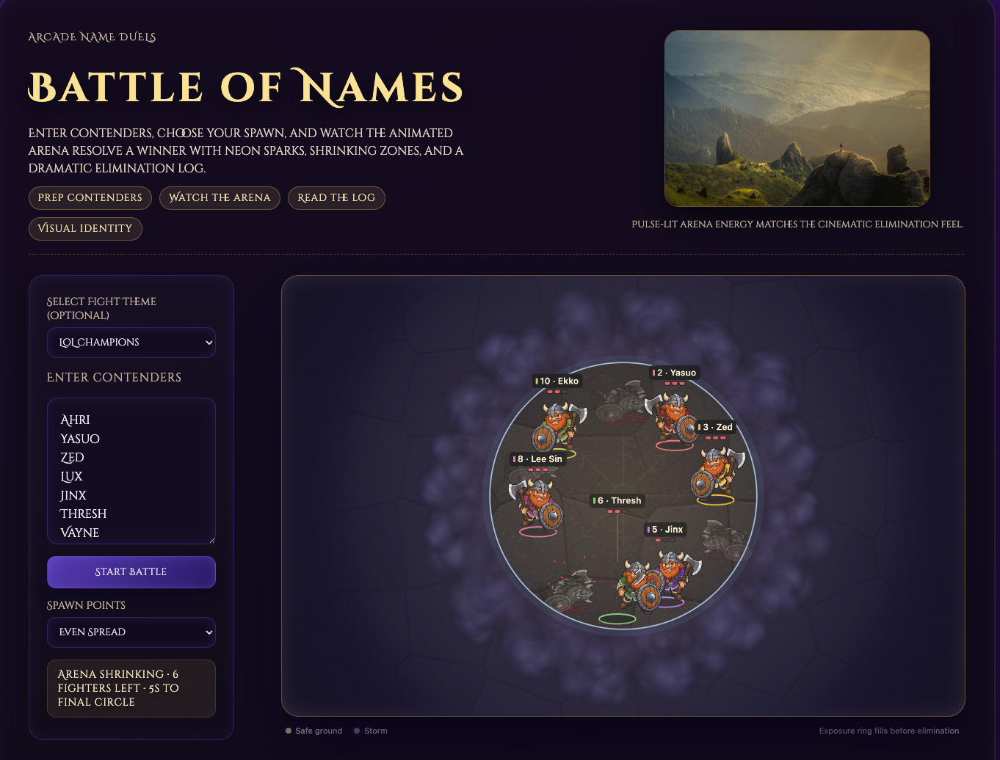

# v2 — The Astra adventure

**Session:** 25–26 September 2026  
**Coding model:** GPT-6 Astra; the user explicitly selected High reasoning during the design discussion  
**Starting point:** The existing GPT-5-Codex game  
**Git checkpoint:** `975ab02` — “Polishing the game with Astra 6”  
**Status:** Session retrospective; the journal itself was added after that checkpoint

## The current iteration

*The Astra version in action, with illustrated fighters, a textured arena, layered storm clouds and persistent fallen bodies. Screenshot supplied by the project author for this retrospective. Compare with the [first iteration](v1-gpt-5-codex.md#the-first-iteration).*

## Coming back to a working game

Almost a year after the first prototype, the project was revisited for a review. The core idea still worked: names became fighters, the arena closed in, and a winner emerged. The opportunity was to make the action easier to read, improve the character art and give the environment more character while preserving the site's purple fantasy atmosphere.

The session moved between code review, asset experiments, live battles and small corrections from the project's author. Those corrections shaped the result as much as the initial plan.

## 1. Review and maintenance

We reviewed the existing project and updated its development tooling. Repeated macOS alerts around the optional `fsevents` native module led to a project-local disabled replacement. The game retained its small TypeScript/Vite foundation and existing colour utility.

One important gameplay correction came early: the author rejected protecting the last two fighters until a target duration had elapsed. The resulting rule is to fight until one remains, with no artificial minimum duration and no forced winner chosen by the old 13.5-second timeout.

## 2. Make the visual system visible

We created a separate **Visual Identity** page at `/visual-identity/` to collect the existing palette, fighter presentation, arena and storm effects. It became a place to compare changes without repeatedly starting a full battle.

Three generated Viking directions were explored: playful Norse, painted fantasy and clean illustrated. The author chose **clean illustrated**. Image generation supplied the artwork; Astra handled the coding and integration. The exact image-generation model was not recorded in the project notes.

The chosen character was developed into separate body, axe and shield assets. A workshop demonstrated idle movement, walking, attacking, taking a hit and colour variations before the assets were introduced into the game. The prompts and original images were retained in the [art-direction documentation](../art-direction/viking-prompts-v1.md) and [illustrated asset notes](../art-direction/illustrated-v2.md).

## 3. Make the hits feel like fighting

The first illustrated battle looked better, but exposed a problem: fighters could bounce together while their axes swung without appearing to strike each other.

The subsequent iterations addressed the action itself:

- Aim the swing toward the opponent and align damage with blade contact.
- Preserve the original axe hold at rest, turning the blade during the strike and returning it during recovery.
- Refine the weapon position after feedback that the blade crowded the Viking's face and the altered grip looked wrong.
- Shorten the wind-up and reduce the stop-before-swing behaviour, making exchanges more direct.
- Add recoil and bounded blood-splatter effects so hits remain readable in a crowded battle.
- Expand the shirt palette to twelve colours, with matching identity accents.
- Leave translucent grey bodies behind living fighters until the next round.

The resulting melee animation has a 25 ms wind-up, contact at 80 ms and a 260 ms total animation. These are implementation settings at this checkpoint, not fixed future requirements.

## 4. Give the arena atmosphere and readable danger

The arena needed to fit into the page rather than feel like an unrelated picture placed on top. We added a subdued stone floor with seams, worn carvings and moss, keeping the centre quiet enough for small characters and labels.

The battle storm uses layered violet clouds, mist and lightning. Its visible safe boundary follows the gameplay radius, while fighter exposure indicators and status text help show who is in danger. Even Spread was also corrected so the full Viking footprint starts inside the safe area.

Generated arena and storm images remain useful workshop concepts. The live arena uses a procedural Canvas 2D renderer with cached textures and bounded cloud layers. This distinction matters: the session explored image assets without making every visual a large image or replacing the graphics engine.

## 5. Keep the new art lightweight

At battle scale, the original 1254 px character images carried much more detail than viewers could see. We generated 256 px WebP sprites for battles and 512 px versions for the workshop, retaining the original PNGs as source artwork.

| Character asset measurement | Before optimisation in this session | After |
| --- | --- | --- |
| Files loaded for battle characters | Three body PNGs plus axe and shield | Twelve body WebPs plus axe and shield |
| Total file bytes | 4,348,801 | 222,606 |
| Approximate download size | 4.35 MB | 223 KB |
| Shirt-colour generation | Browser pixel processing | Generated files prepared ahead of time |

That is a **94.88% reduction in battle character asset bytes**, despite including all twelve colours. This compares two stages of the Astra work; it is not a claim that the original procedural GPT-5-Codex version downloaded 4.35 MB of character art. It also excludes the rest of the page and workshop assets.

The asset pipeline checks source and output hashes. Unchanged checkouts use the generated files directly; regenerating artwork uses Python/Pillow without adding an image-processing npm dependency.

We also reused scoreboard heart elements, updated status text only when it changed, and replaced hit-pulse restarts that read layout with opacity animations. Nameplates and arena textures are cached, particle counts are bounded, and canvas pixel density is capped.

## 6. What we verified

The production build, asset consistency check and five focused tests passed during the session. Browser checks covered the twelve outfits, eliminations, winner state, roster reset and workshop visuals, with no warnings or errors reported in the inspected console logs.

The author then supplied a browser performance screenshot covering approximately 13.18 seconds:

| Recorded metric | Value |
| --- | --- |
| Interaction to Next Paint | 39 ms |
| Cumulative Layout Shift | 0 |
| Scripting | 271 ms |
| Painting | 181 ms |
| Rendering | 69 ms |
| JavaScript heap range | 3–7.3 MB |

The screenshot suggested low main-thread overhead on that machine. It was not a controlled before/after benchmark, a GPU profile, a sustained frame-rate measurement or a mobile-device test. Repeated heap drops were consistent with garbage collection; the short capture could not establish long-term memory behaviour.

## What changed in the way we worked

The original phase turned a brief and improvement lists into a functioning product. This phase used that foundation to make visual decisions through concrete comparisons: choose a style, try a layered character, watch it fight, adjust the axe, speed up the exchange, then make the result cheaper to load.

The author's feedback was specific and consequential: keep the attractive original hold, flip the axe during the swing, add colour variety, show fallen bodies, make storm exposure clearer, and remove the pause before attacks. The Visual Identity page gave those discussions a shared reference.

The result is still the same game, with a more defined illustrated identity and a better connection between what the combat simulation does and what the viewer sees.

## Where this chapter ends

- The illustrated fighters, revised combat, arena/storm treatment and optimisations are implemented at `975ab02`.
- Initial requirements are consolidated in [Requirements v1](../../specs/requirements-v1.md).
- The development server was stopped at the author's request.
- Further frame-timing, GPU, slower-device and repeated-battle checks remain possible follow-up work, rather than completed validation.
- Direction-specific character drawings, additional animation frames and audio remain potential future work, not commitments from this session.

**Previous:** [v1 — Building the game with GPT-5-Codex](v1-gpt-5-codex.md) · [Journal index](README.md)
